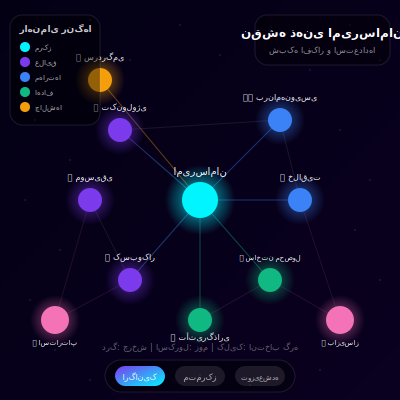
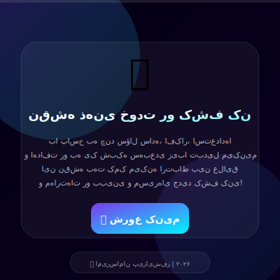
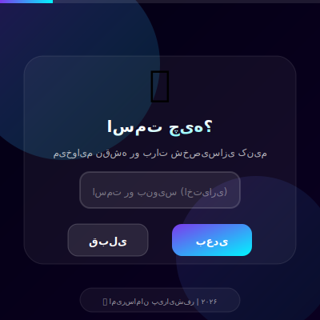
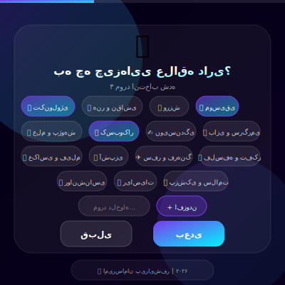
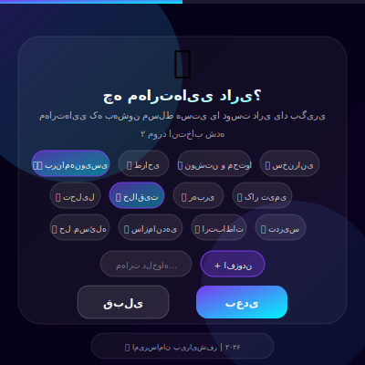
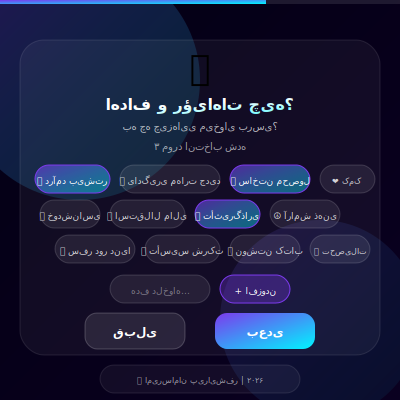
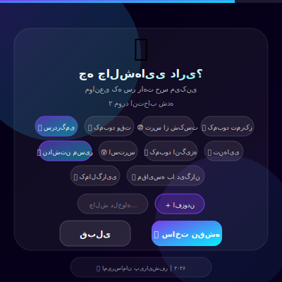
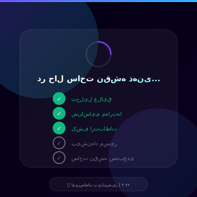
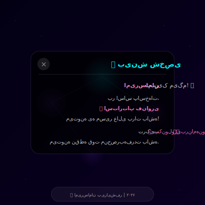
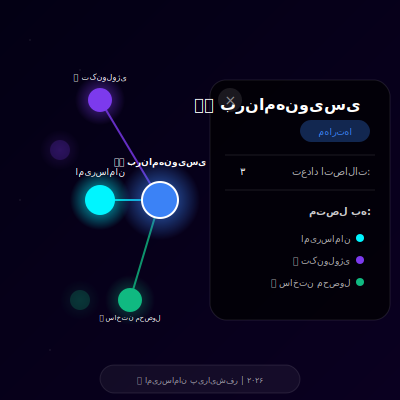

# 🧠 نقشه ذهنی سه‌بعدی | 3D Mind Map

<div align="center">


**یک ابزار تعاملی برای کشف و نمایش شبکه ذهنی شما**

[🚀 دمو زنده](https://YOUR_USERNAME.github.io/mind-map-3d/) | [📖 مستندات](#نحوه-استفاده) | [💡 ویژگی‌ها](#ویژگیها)



</div>

---

## 📌 درباره پروژه

نقشه ذهنی سه‌بعدی یک اپلیکیشن تک‌صفحه‌ای است که با پاسخ به چند سؤال ساده، علایق، مهارت‌ها، اهداف و چالش‌های شما را به یک شبکه سه‌بعدی تعاملی و زیبا تبدیل می‌کند.

این ابزار به شما کمک می‌کند:
- 🔍 ارتباط بین علایق و مهارت‌هایتان را کشف کنید
- 🎯 مسیرهای شغلی و زندگی مناسب خود را بیابید
- 💡 نقاط قوت منحصربه‌فردتان را بشناسید
- 🌟 بینش جدیدی نسبت به خودتان پیدا کنید

---

## ✨ ویژگی‌ها

### 🎨 ویزارد پرسشنامه
- ۷ مرحله ساده و جذاب
- رابط کاربری شیشه‌ای (Glassmorphism)
- انیمیشن‌های نرم و روان
- پشتیبانی کامل از زبان فارسی (RTL)
- قابلیت افزودن موارد دلخواه

### 🌐 نقشه سه‌بعدی
- گراف تعاملی با Three.js
- شبیه‌سازی فیزیک (Force-Directed Layout)
- سه حالت نمایش: ارگانیک، متمرکز، توزیع‌شده
- ۲۰۰۰ ستاره متحرک در پس‌زمینه
- هاله‌های درخشان و ذرات متحرک

### 🤖 هوشمندی
- تشخیص ارتباطات معنایی بین انتخاب‌ها
- پیشنهاد ۱۰ مسیر شغلی/زندگی
- تولید بینش شخصی‌سازی شده

### 📱 سازگاری
- طراحی کاملاً ریسپانسیو
- پشتیبانی از لمس (Touch)
- عملکرد روان حتی با ۳۰+ گره

---

## 🖼️ اسکرین‌شات‌ها

<div align="center">

### مرحله ۰ — خوش‌آمدگویی


> صفحه شروع با انیمیشن ایموجی شناور و توضیح کوتاه درباره اپلیکیشن

---

### مرحله ۱ — نام کاربر


> امکان ورود نام برای شخصی‌سازی نقشه ذهنی

---

### مرحله ۲ — انتخاب علایق


> ۱۵ گزینه پیش‌فرض با ایموجی + قابلیت افزودن دلخواه

---

### مرحله ۳ — مهارت‌ها


> ۱۲ مهارت برای انتخاب + امکان اضافه کردن موارد جدید

---

### مرحله ۴ — اهداف و رؤیاها


> تعیین اهداف کوتاه‌مدت و بلندمدت زندگی

---

### مرحله ۵ — چالش‌ها


> شناسایی موانع و چالش‌های پیش‌رو

---

### مرحله ۶ — پردازش


> انیمیشن پردازش با ۵ مرحله متوالی

---

### نقشه سه‌بعدی


> گراف تعاملی سه‌بعدی با اتصالات معنایی

---

### بینش شخصی


> نمایش پیشنهادات و بینش‌های شخصی‌سازی شده

---

### انتخاب گره


> نمایش جزئیات گره و اتصالات آن

</div>

---

## 🎨 رنگ‌بندی گره‌ها

| دسته | رنگ | کد |
|------|-----|-----|
| 🔵 مرکز | سایان | `#00f5ff` |
| 🟣 علایق | بنفش | `#7c3aed` |
| 🔷 مهارت‌ها | آبی | `#3b82f6` |
| 🟢 اهداف | سبز | `#10b981` |
| 🟠 چالش‌ها | نارنجی | `#f59e0b` |
| 🩷 پیشنهاد مسیر | صورتی | `#f472b6` |

---

## 🚀 نحوه استفاده

### روش ۱: اجرای مستقیم
فایل `index.html` را در مرورگر باز کنید.

### روش ۲: با سرور محلی
```bash
# با Python
python -m http.server 8000

# با Node.js
npx serve .

# با PHP
php -S localhost:8000
```

سپس به آدرس `http://localhost:8000` بروید.

---

## 🛠️ تکنولوژی‌ها

- **HTML5** — ساختار
- **CSS3** — استایل‌دهی (Glassmorphism, Animations)
- **JavaScript (ES6+)** — منطق برنامه
- **Three.js r128** — گرافیک سه‌بعدی
- **Vazirmatn Font** — فونت فارسی

---

## 📁 ساختار پروژه

```
mind-map-3d/
│
├── index.html              # فایل اصلی برنامه
├── README.md               # مستندات
├── LICENSE                 # مجوز MIT
├── .gitignore              # فایل‌های نادیده
├── GITHUB_GUIDE.md         # راهنمای انتشار در گیت‌هاب
├── INSTAGRAM_POSTS.md      # محتوای شبکه‌های اجتماعی
│
└── docs/                   # اسکرین‌شات‌ها (SVG)
    ├── step-0-welcome.svg
    ├── step-1-name.svg
    ├── step-2-interests.svg
    ├── step-3-skills.svg
    ├── step-4-goals.svg
    ├── step-5-challenges.svg
    ├── step-6-processing.svg
    ├── map-3d-view.svg
    ├── insight-toast.svg
    └── node-selection.svg
```

---

## 🤝 مشارکت

از مشارکت شما استقبال می‌کنیم! لطفاً:

1. پروژه را Fork کنید
2. یک Branch جدید بسازید (`git checkout -b feature/amazing-feature`)
3. تغییرات را Commit کنید (`git commit -m 'Add amazing feature'`)
4. به Branch خود Push کنید (`git push origin feature/amazing-feature`)
5. یک Pull Request باز کنید

---

## 📝 مجوز

این پروژه تحت مجوز MIT منتشر شده است. برای جزئیات بیشتر فایل [LICENSE](LICENSE) را ببینید.

---

## 👨‍💻 توسعه‌دهنده

<div align="center">

**امیرسامان پیرایش‌فر**

طراحی، ایده و توسعه

[](https://github.com/pirayeshfar)
[](https://linkedin.com/in/pirayeshfar)

---

ساخته شده با 💜 در سال ۲۰۲۶

</div>
